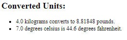
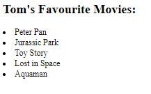
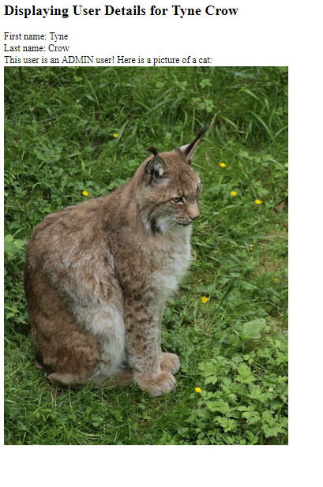
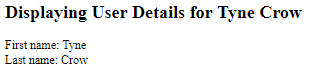

Web Lab 12 &ndash; JSP/JSTL/EL
==========

Begin by forking this repository into your namespace by clicking the ```fork``` button above, then selecting your username from the resulting window. 
Once completed, click the ```clone``` button, copy the ```Clone with HTTPS``` value. Open IntelliJ, and from the welcome screen 
click ```Check out from Version Control -> Git```, then paste the copied URL into the ```URL``` field of the resulting window. 
Provide your GitLab username and password if prompted.

Explore the files in the project, familiarizing yourself with the content.

Make sure to look at the code within the example files. They demonstrate some key concepts that will be used in the lab.

When complete, demonstrate your code to your tutor.

Exercise 1 &ndash; Displaying Basic Request Attributes with JSTL
==========

For this exercise, you will use the [`UnitConverter`](./src/ictgradschool/web/exercise01/UnitConverter.java) servlet that processes form data from the [`unit-converter.html`](./web/unit-converter.html) form.

The unit converter servlet already has methods for converting the units required but it does not yet handle any form data or use the methods.

Get the form data in the servlet and use the existing methods within the `UnitConverter` servlet to convert the units. 

Complete the `doGet()` method of the servlet so that the information from the form can be converted and displayed within the [`WEB-INF/exercise01/exercise01.jsp`](./web/WEB-INF/exercise01/exercise01.jsp).
Use the `RequestDispatcher` to forward the servlet onto [`WEB-INF/exercise01/exercise01.jsp`](./web/WEB-INF/exercise01/exercise01.jsp). 

In the JSP file use appropriate JSP EL expressions to display the information. Check the reference information on EL expressions. 
 
When completed you should display both the original and converted units in sentences something like this:




Exercise 2 &ndash; Movie List
==========

For this exercise you will use the [`movie-list.html`](./web/movie-list.html) form to get an array of the users favourite movies.

The form has been created for you and there is an empty servlet in the exercise02 package.

You will need to complete the servlet methods, give the servlet appropriate `name` and `urlPatterns` values, and create the `.jsp` file for this exercise. 

__NOTE__: Looking at the form found within [`movie-list.html`](./web/movie-list.html), you will notice that all of the input `name` attributes have the same value `name="movies"`. For this task you will use a new method of the [`HttpServletRequest`](https://docs.oracle.com/javaee/6/api/javax/servlet/ServletRequest.html) object. [`HttpServletRequest.getParameterValues(...)`](https://docs.oracle.com/javaee/6/api/javax/servlet/ServletRequest.html#getParameterValues\(java.lang.String\)) returns an array of all values from form elements with the matching name attribute. 

Suggested steps:
+ Connect the form to the servlet with an appropriate `urlPatterns`
+ Create a `doGet` method within the servlet (_HINT_: Use IntelliJ's code generator to override the `HttpServlet.doGet()` method)
+ Create the appropriate variables and use appropriate `HttpServletRequest` methods to store a string for the name of the user and a string array for all 5 favourite movies (read the note about about `.getParameterValues(..)` )
+ Remember to set appropriate request attributes to display the user's name and the list of movies
+ Create a `.jsp` file to display a list of the users favourite movies 
    - Do not forget to add the correct tags at the top of the `.jsp` file to enable JSTL; have a look at the examples
    and Exercise 1
+ Use [`RequestDispatcher`](https://docs.oracle.com/javaee/6/api/javax/servlet/RequestDispatcher.html) in the servlet to forward on to the `.jsp` file 
+ Within the `.jsp` file, use appropriate JSP EL expressions and JSTL tags to loop through the array of strings and display the appropriate information within a list in the page generated by the `.jsp` file 
    - You should also use a JSTL `if` tag to check the length of each string in the string array so that any empty form elements will not display as empty bullet points in the list. Test submitting the form with one or more fields empty to see if this works

The finished page should look something like this:
 


Remember to check the examples or JSP, JSTL and EL reference information if you get stuck. 

Exercise 3 &ndash; User Details Servlet and Java Bean
=======================

For this exercise you will need to create the necessary Java classes and `.jsp` file. 

You have __not__ been given the servlet or Java Bean so you will need to think carefully about how to create these. 

You will create a Java Bean to store information about a user submitted from the [`user-details.html`](./web/user-details.html) form. An instance of the Java Bean will then be set as a request attribute for the `.jsp` page to display. 

Look very carefully at `example01` - [`CarAdJavaBean`](./src/ictgradschool/web/labexamples/example01/CarAdJavaBean.java) and [`CarAdServlet`](./src/ictgradschool/web/labexamples/example01/CarAdServlet.java). Observe how these examples work and how information is displayed within the associated `.jsp` file with EL expressions. You should also read [reference information
about Java Beans](https://www.javatpoint.com/java-bean).

Tasks: 
+ Create a servlet to process the form data and a Java Bean to encapsulate the necessary information about the user
+ The Java Bean should have the necessary properties to store all 3 types of information input in the form and have getters and setters for all of these properties
    - It should also have an zero-argument constructor
+ Complete all of the necessary code within the servlet to process the form data and store it within an instance of the Java Bean 
+ Create a `.jsp` file and link it to the servlet so that the servlet can display all necessary information from the Java Bean

Extra content for admin users
+ You should use a JSTL `if` tag to display an extra sentence and image for admin users. In a real site this would often be a link to an administrator page or some other content only administrators can access, for this page just add an extra sentence saying `This user is an ADMIN user! Here is a picture of a cat: ` and display one of the images from the image folder.

When finished the `.jsp` page should display something like this for an admin user: 



And this for a non-admin user: 



Exercise 4 &ndash; Image Gallery
========================

In this exercise, you will complete the ImageGallery servlet that is within the `exercise04` package and create a `.jsp` file to display all images in the `web/images` folder. 

For this task it is important to remember that request attributes can store a range of data types. An array of image files can be forwarded onto a `jsp` file.  

You should also use reference information and examples to research how you can use JSTL tags within your `.jsp` file to display all `images` from the folder. Looping through an array of image files should not be too different to looping through an array of strings which you have already done. 

_HINT_: You can use this line of code in the servlet to get a reference to the folder that the images are in:
  - `File imageFolder = new File(getServletContext().getRealPath("/images"));`.

Once you have a reference to the images folder, you may need to research what other 
methods could be used to get an array of files from the images folder. 


_HINT_: Remember that the most important part of displaying the images correctly is that you get the reference to the image paths and filenames within the `src` attribute of `img` elements within the `.jsp` file. There are multiple ways you could achieve this. Remember the difference between absolute and relative file paths. 

Do not forget to setup the `urlPatterns` of your Servlet so that you can access it.

When your image gallery servlet is complete it should look something like this:


Exercise 5 &ndash; File Upload
========================

Within the `exercise05` package there is a servlet named [`FileUpload`](./src/ictgradschool/web/exercise05/FileUpload.java). 

The [`file-upload.html`](./web/file-upload.html) form links to this servlet. 

All of the code to allow users to upload image files should be complete within this servlet.

Add a [`RequestDispatcher`](https://docs.oracle.com/javaee/6/api/javax/servlet/RequestDispatcher.html) to the servlet so that the user is forwarded onto the [`ImageGallery`](./src/ictgradschool/web/exercise04/ImageGallery.java) servlet after submitting their image. 

Test the form and servlet by uploading an image. 

Observe how this code works and where the images appear within the `out` folder of your project when you upload them. 

You will be needing to implement file uploads in later projects so it is important that you familiarise yourself with the code behind the [`FileUpload`](./src/ictgradschool/web/exercise05/FileUpload.java) servlet. 

The `commons-fileupload-1.3.2.jar` and `commons-io-2.5.jar` files within the `lib` folder provide the functions used within the [`FileUpload`](./src/ictgradschool/web/exercise05/FileUpload.java) servlet. Remember that when you implement file uploads in other projects you will also need to add libraries. The same is true for JSTL.  

Exercise 6 &ndash; JSP:Include Nav Menu
========================
    
You may have noticed that [`index.jsp`](./web/index.jsp) and the example `.jsp` files use an `<jsp:include page="/WEB-INF/nav/nav.jsp" />` tag to display the same nav menu on all pages. Locate the [`nav.jsp`](./web/WEB-INF/nav/nav.jsp) file within the `WEB-INF` folder and add links to all of the exercises you have completed. 

Add the `<jsp:include page="/WEB-INF/nav/nav.jsp" />` tag to all of the `.jsp` files that you have created so that you can navigate
all of the activities that you have completed in the lab. 


 

